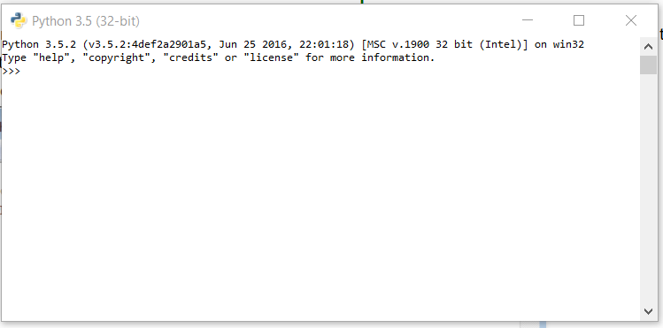

# Python Installation



1. download Python from [https://www.python.org/downloads/](https://www.python.org/downloads/) and now install from the setup and in the start menu type IDLE.IDLE, you can think it as a Python’s IDE to run the Python Scripts.&#x20;
2. It will look somehow this:

<figure><figcaption></figcaption></figure>



1. download Python from [https://www.python.org/downloads/](https://www.python.org/downloads/) and now install from the setup&#x20;
2. Open Terminal and type `python3` and press enter







